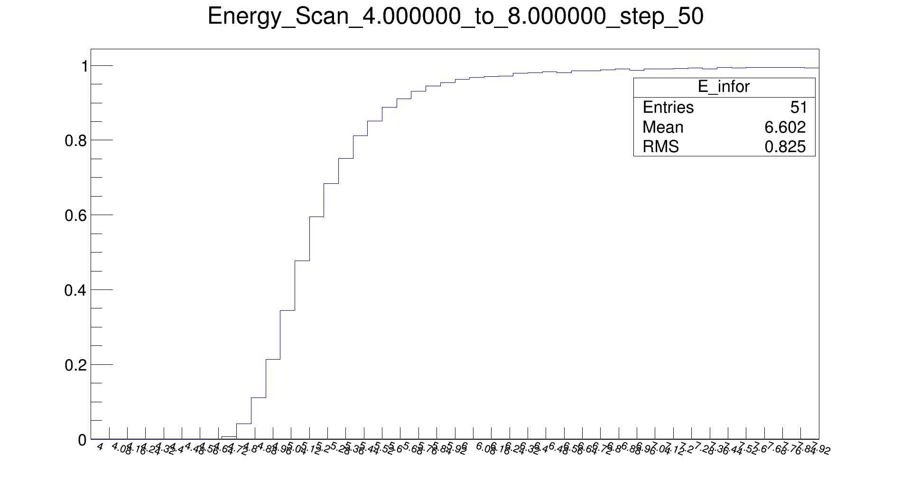

# cosmic absorbtion G4 simulation Toy
> A small toy that used for simulate the cosmic absorbtion in U238

[![Build Status][travis-image]][travis-url]



## Installation

The Program is write and tested in UBUNTU 16.04

* [ROOT5.34.36](https://root.cern.ch/)
* [Geant4.10.03.p01](https://geant4.web.cern.ch)

To install ROOT AND Geant4
	You can use the small scrapt to install the grant4 and root if you didnot install those packages
	it will downloads and install and compile Geant4 automaticly
```
mkdir ROOT
cd ROOT
git clone https://github.com/Jiansiyu/cmake_geant4.git
cp cmake_geant4/cmake_geant4.sh ./
./cmake_geant4.sh 4.10.03.p01
```
```
mkdir root
git clone https://github.com/Jiansiyu/installROOTsource.git
The following steps are listed in the readme files
```


Ubuntu
```sh
mkdir ${path}
cd ${path}
git clone https://github.com/Jiansiyu/g4cosmicAB.git
mkdir g4cosmicAB-build
cd g4cosmicAB-build
cmake ../g4cosmicAB
make -j4
```


## Usage example

Material of the TARGET
The source files are located in the 'src' folder. The material of the Target can be changed in 'MuonDetectorConstruction.cc'

The code can run as regular Geant4 interactive GUI mode, Batch mode or Scan mode
##GUI mode
./Muon_tomography

##batch mode
./Muon_tomography  xxx.mac

##Scan batch mode

* generate the batch.bh files 
	* cd macros 
	* root -l macros.C
	* .q (to exit root)
* run the batch
	* choice one, run as batch mode example: 
		```./Muon_tomography macros/mu+_Energy5.28_events5000.mac```
	* Scan mode,  run as 
		```./Muon_tomography macros/batch.bh```

## Result
* The individual result will save as xxx.c file in the "Result"  direction. To check the result: 
	```root -l xxx.C```
* In Scan mode, it will generate the Scan result and save in current path: To check the result: 
	```root -l xxx.C```

## Questions and Bug Report
jiansiyu@gmail.com

